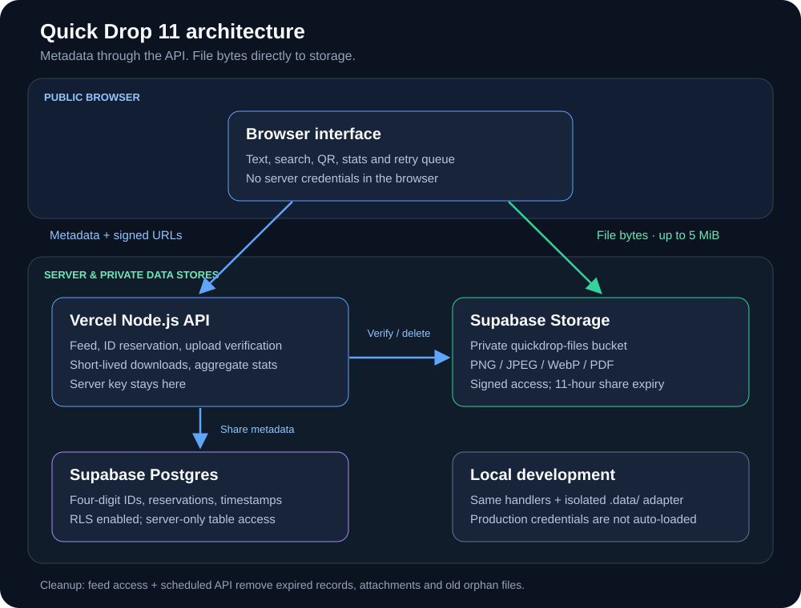

# Quick Drop

**Live website:** [quickdrop11.vercel.app](https://quickdrop11.vercel.app)

Share text, images and PDFs through a single public feed. Each share gets a **four-digit ID** so users can find it during busy periods. Shares expire after **11 hours**.

**Quick start:** [Run locally](#run-locally) · [Deploy](#deploy-to-vercel) · [Architecture](#architecture-at-a-glance) · [Stats and privacy](#public-stats-and-privacy)

## Features

- Search by ID, text or filename across active shares; up to 200 matches per search.
- One PNG, JPEG, WebP or PDF attachment per share, up to **5 MiB (5,242,880 bytes)**; text up to 10,000 characters.
- Attach through the file button, drag-and-drop into the text area, or paste supported clipboard files. Text can accompany an attachment.
- Copy for text shares, QR links and communal deletion. File shares have download links instead of Copy.
- Two columns on screens at least 1000 px wide; one column on smaller screens.
- Manual Refresh, dark/light themes, and an offline upload queue that retries with the same request ID.
- An icon beside the connection badge opens public aggregate site stats.

IDs range from 0000 to 9999, with at most 10,000 active reservations. Slots can be reused after expiry or deletion. There are no chat rooms or accounts.

## Architecture at a glance



The frontend, upload handling, stats and storage adapters are separate modules. Production file uploads go directly to Supabase Storage; the API authorizes and verifies them before publishing a share. Local development uses isolated disk storage.

See the [architecture guide](docs/ARCHITECTURE.md) for component, upload-sequence and expiry diagrams, plus a debugging map. The [brand kit](docs/brand/README.md) includes the icon, wordmark and banner.

## Run locally

Requires Node.js 22 or newer.

```sh
npm ci
npm run build
npm start
```

Open http://localhost:3000. Run the build again after changing `frontend/uploads.js`; it creates the ignored browser bundle. Local shares persist in `.data/`, separately from production. The development server binds to loopback and does not automatically load `.env.local` or production credentials.

## Supabase backend

Use the [Supabase setup guide](docs/SUPABASE.md) and `supabase/schema.sql` to configure private file storage and Postgres share metadata. The server adapter is `lib/supabase-storage.js`. Direct uploads, four-digit IDs, 11-hour expiry and the public stats popup work with this backend. Connection requires the server-side variables and SQL setup; the adapter alone does not provision an account.

## Deploy to Vercel

1. Import the GitHub repository into Vercel and configure Supabase using the guide above, or connect a public Supabase Storage (or legacy Vercel Blob) store for the legacy backend.
2. Configure `QUICK_DROP_STORAGE_PROVIDER=supabase`, `QUICK_DROP_SUPABASE_URL`, `QUICK_DROP_SUPABASE_SERVICE_KEY` and `CRON_SECRET` on the server. See `.env.example`; never commit populated credentials.
3. Set the build command to `npm run build` and the output directory to `public`. Keep the root `api/` functions enabled.
4. Optionally set `QUICK_DROP_STORAGE_ALLOWANCE_BYTES` to match your plan. Its default is 1,000,000,000 bytes, displayed as the configured storage capacity.
5. Verify text sharing, a 5 MiB attachment, retry behavior, search, deletion, stats and scheduled cleanup on the deployment before relying on it.

Production attachments go **browser → Supabase Storage**, using signed upload URLs for reserved paths. The private bucket restricts content types and file size. The server checks the stored file's size, basic byte signature and SHA-256 before publishing its share. Large file bytes do not pass through the Vercel Function request body. Local uploads use the local file store.

`/api/cleanup` uses `CRON_SECRET` and the daily schedule in `vercel.json`. Feed access also removes expired records. Physical removal is periodic, rather than guaranteed at the exact expiry second. Cleanup removes sufficiently old orphan attachments as well.

Vercel has separate storage, transfer and operation allowances. See [Blob usage and pricing](https://vercel.com/docs/vercel-blob/usage-and-pricing) for current limits. Direct uploads bypass the Function payload limit; they do not increase storage allowances. The public app does not enforce a global billing quota.

## Public stats and privacy

The stats popup shows active share count, current stored bytes, space below the configured allowance, file limits and the last check time. Live Supabase storage totals include all objects in the Quick Drop bucket. Local totals describe local share metadata and attachments, not cloud billing.

Current stored bytes are a snapshot, **not monthly billed usage**. Exact monthly storage remaining, download remaining and operation balances are unavailable in this implementation and are labeled accordingly. The private storage-provider dashboard remains the source for billing usage. Stats are cached for five minutes per server instance.

Stats responses contain aggregate numbers only. They do not expose credentials, environment variables, account identifiers or file lists. Upload authorization uses server-side credentials; the browser receives a scoped temporary upload token.

The feed and attachment URLs are public. Four-digit IDs are lookup shortcuts, not passwords. Deletion is communal. The app validates file type and signature but does not scan for malware. Local downloads enforce expiry; Supabase download links expire after at most 60 seconds; legacy public Blob URLs may remain accessible until physical deletion, and downloaded or cached copies cannot be recalled. The persistent upload queue uses browser local storage and can be constrained by browser quota, especially for several large attachments.

## Project structure

| Path | Purpose |
| --- | --- |
| `public/` | Page, styles, main UI and separate stats UI |
| `frontend/uploads.js` | Direct upload client, bundled during build |
| `api/texts.js`, `api/files.js` | Feed, text mutations and downloads |
| `api/uploads.js`, `lib/direct-uploads.js` | Upload reservation, scoped tokens and verification |
| `api/stats.js` | Public aggregate stats |
| `api/cleanup.js` | Scheduled cleanup |
| `lib/` | Storage adapters, file validation and HTTP helpers |
| `server.js` | Local development server |
| `tests/` | API, client and upload tests with small fixtures |
| `.github/workflows/validate.yml` | GitHub build and test checks |
| `docs/` | Architecture diagrams, debugging guide and SVG brand assets |

## Validation

```sh
npm run build
npm test
```

The build generates the upload bundle and checks JavaScript syntax. Tests cover concurrent sharing, ID collisions, retries, file validation including 5 MiB files, storage failures, search, expiry and deletion. Live Blob integration requires a configured deployment check; local tests do not prove live credentials or provider configuration.

## Legacy migration

`npm run migrate` previews import of older production snapshots. `npm run migrate -- --apply` imports active shares with four-digit IDs and their remaining lifetime. Stop old writers and review the dry run first. The script preserves source snapshots and explicitly reads `.env.local` when invoked. It is not part of normal startup.

## GitHub contents

Commit source, tests, `package-lock.json`, configuration, `.env.example`, this README and the MIT license. `.gitignore` excludes installed dependencies, the generated upload bundle, `.data/`, `.vercel/`, populated environment files, logs and caches. Build the bundle after a fresh clone; do not commit secrets or local share data.

## Rename compatibility

Quick Drop preserves browser cache, theme and queued uploads from the earlier Temp-Transfer name. Existing storage paths and four-digit share links remain compatible. QUICK_DROP_STORAGE is the optional local remote-storage switch; the previous TEMP_TRANSFER_STORAGE variable remains a compatibility fallback. Renaming the app does not change an existing Vercel project name, domain or GitHub repository name.
