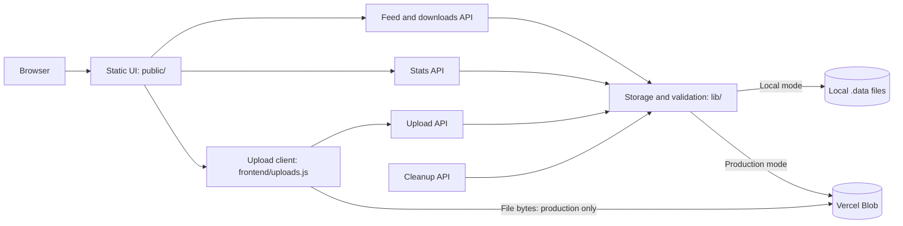
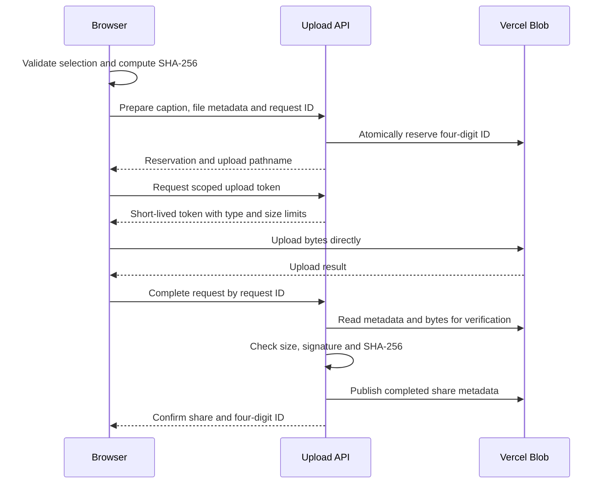
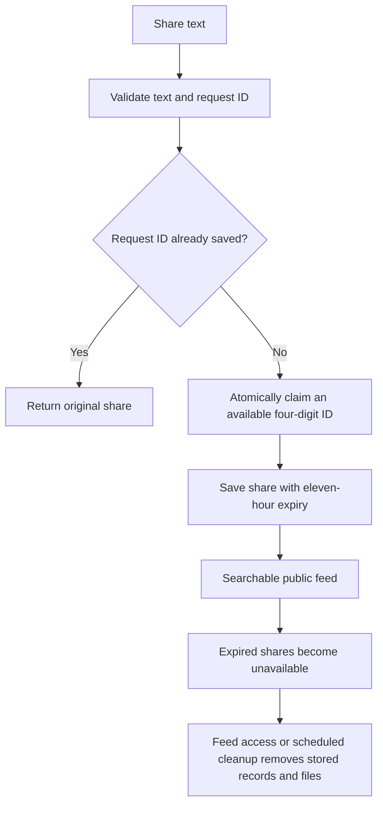

# Architecture

Quick Drop uses a static browser interface and small Node.js API handlers. The same feed logic runs against either local disk or Vercel Blob; local development never connects to production automatically.

## Components

The stats handler also lists Blob objects directly to obtain their current total size. Only aggregate figures reach the browser. Read/write credentials remain in server environment variables.

## Production attachment upload

Completion is requested by the browser; this implementation does not depend on a Blob completion webhook. Verification reads file bytes inside the server, but the browser's upload request does not carry those bytes through a Function.

The browser retains failed jobs in its local outbox. Retries reuse the request ID and reservation. If bytes were already uploaded, a retry attempts completion before uploading again. Pending reservations stay hidden from search results. Expired reservations and sufficiently old orphan files are removed by cleanup.

## Text sharing and expiry

Expiry hides shares based on their stored timestamps. Physical cleanup can happen later. Previously cached or downloaded public files cannot be recalled.

## Debugging map

| Symptom | Start here |
| --- | --- |
| File selection, drag/drop or queue problem | `public/script.js` |
| Token or direct-upload failure | `frontend/uploads.js`, `api/uploads.js` |
| Reservation or file verification failure | `lib/direct-uploads.js`, `lib/files.js` |
| Missing share, ID collision or persistence failure | `api/texts.js`, `lib/storage.js` |
| Stats failure or stale figures | `public/stats.js`, `api/stats.js` |
| Expired files remain stored | `api/cleanup.js`, `lib/storage.js`, cron configuration |
| Local server or static-file issue | `server.js` |

Do not paste tokens or populated environment files into issues. Monthly billing balances are intentionally unavailable in public stats; current storage bytes are not a billing meter.
